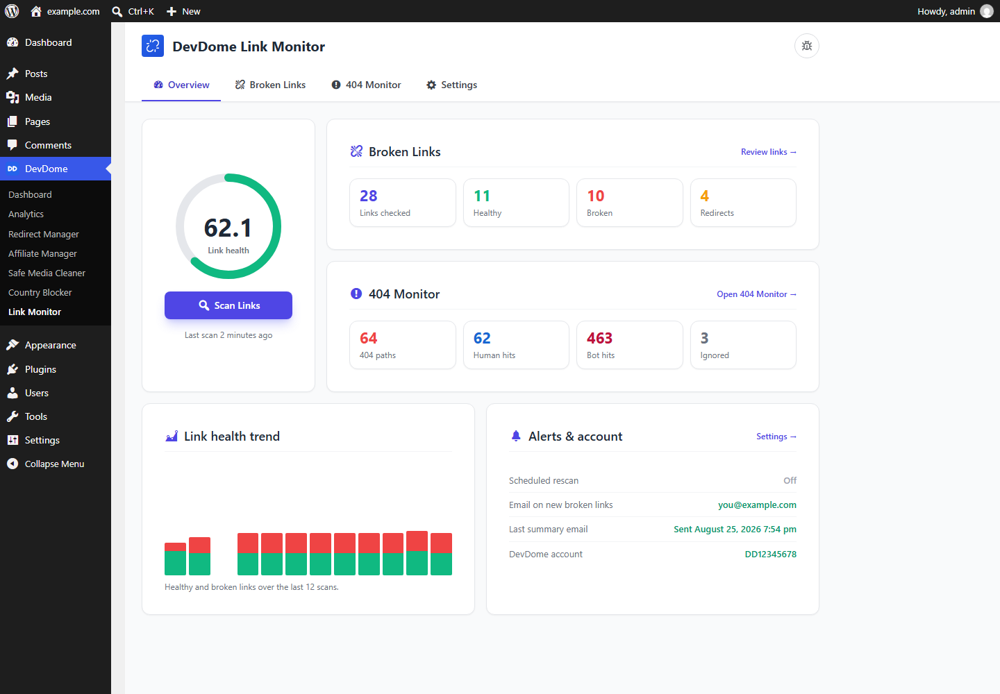
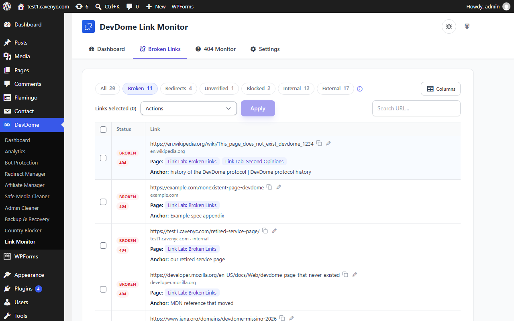
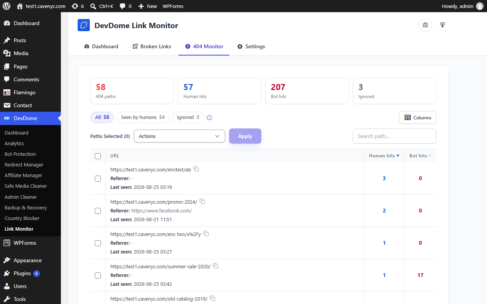
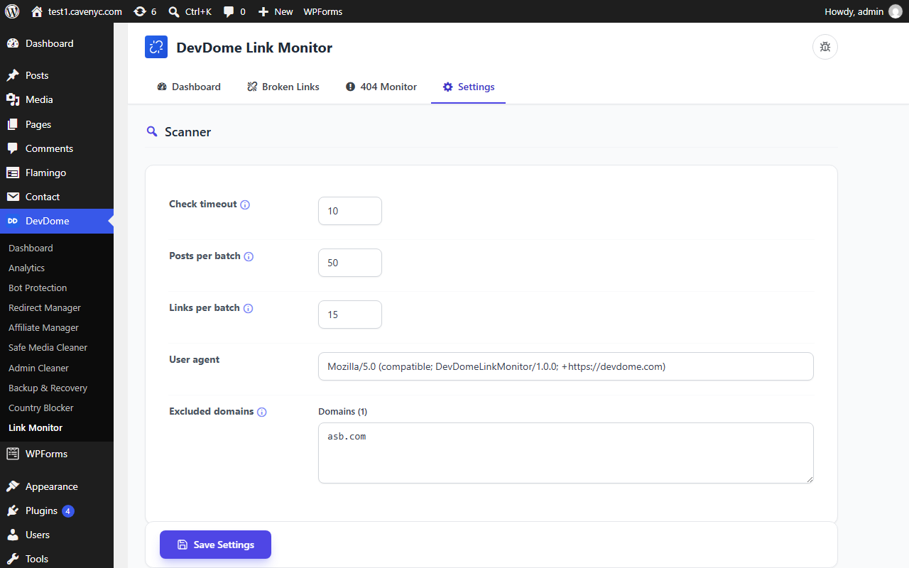

# DevDome Link Monitor - free WordPress broken link checker and 404 monitor

[](https://wordpress.org/plugins/devdome-link-monitor/)
[](https://wordpress.org/plugins/devdome-link-monitor/)
[](https://wordpress.org/plugins/devdome-link-monitor/reviews/)
[](https://wordpress.org/plugins/devdome-link-monitor/)
[](LICENSE)

**The free alternative to Broken Link Checker (WPMU DEV) and Link Whisper for finding broken links and 404s in WordPress.**
Two tools in one: an always-on 404 monitor that logs every missing-page hit with a bot and human split, and an
on-demand broken link scanner that runs in small background slices and marks a link broken only after two failures
separated in time. It says "unverified" instead of guessing, so you never delete a working link.

[](https://devdome.com)

- **Install from WordPress.org:** https://wordpress.org/plugins/devdome-link-monitor/
- **Website:** https://devdome.com
- **Support:** https://wordpress.org/support/plugin/devdome-link-monitor/

## Why DevDome Link Monitor instead of the alternatives

| | DevDome Link Monitor | Broken Link Checker (WPMU DEV) | Link Whisper | Rank Math 404 Monitor | Redirection 404 log | Ahrefs / Screaming Frog |
|---|---|---|---|---|---|---|
| Price | **Free** | Free, cloud needs a WPMU DEV account | from $77 / year | Free (SEO suite) | Free | Paid tools, run by hand |
| Scans the links inside your content | Yes | Yes | Yes | No | No | Yes, externally |
| 404 monitor with human vs bot hits | **Yes** | No | No | Hits only | Hits only | No |
| Two-failure rule against false positives | **Yes** | No | No | n/a | n/a | n/a |
| Background slices, never hammers the server | Yes | Local mode is known for load | n/a | n/a | n/a | External crawl |
| Redirect suggestions from your real slugs | Yes | No | No | No | No | No |
| One-click redirect (with DevDome Redirect Manager) | Yes | No | No | Rank Math | Redirection | No |
| CSV export, auto purge, ignore list | Yes | Partial | No | Partial | Partial | Export |
| Page or link limits | None | None | Per licence | None | None | Per plan |

Prices are the vendors' published plans in September 2026. Ahrefs and Screaming Frog are external crawlers you run
by hand; DevDome watches from inside WordPress, always on.

## Features

- **404 Monitor (always on).** Normalized path, hit counters, last referrer, last user agent, first and last seen,
  bot and human split from the user agent, humans-only view, per-path ignore, CSV export, automatic purging.
- **Broken Link Scanner (on demand).** Chunked, resumable, pausable, cancelable. Runs in background slices from
  your browser or WP-Cron. A link is marked broken only after two failures separated in time; otherwise it is
  "unverified", never guessed.
- **Redirect suggestions.** Every 404 path is fuzzy-matched against your published slugs. With DevDome Redirect
  Manager active you get a one-click redirect, otherwise a copy-ready `.htaccess` rule.
- **Filters** for broken, redirects, unverified, blocked, internal and external links, bulk actions, search, column
  picker.
- **Settings.** Check timeout, posts and links per batch, user agent, excluded domains, scheduled rescans, email on
  new broken links.
- **AI agents and MCP.** Six WordPress Abilities (WordPress 6.9+) so connected AI agents can read broken links and
  404s and run scans. See below.

## Screenshots

[](https://devdome.com)
*Dashboard: link health, broken link totals, 404 totals with human and bot hits, trend and alerts.*

[](https://wordpress.org/plugins/devdome-link-monitor/)
*Broken links: every checked link with status, page and anchor text.*

[](https://devdome.com)
*404 monitor: path, referrer, last seen, human and bot hits.*

[](https://wordpress.org/plugins/devdome-link-monitor/)
*Settings: timeout, batch sizes, user agent, excluded domains.*

## AI agents and MCP (WordPress Abilities API)

Since 1.6.0, on WordPress 6.9 and newer, DevDome Link Monitor registers its read and scan actions as
[WordPress Abilities](https://developer.wordpress.org/apis/abilities-api/). Any AI agent or MCP client connected to
the site through the official [WordPress MCP Adapter](https://github.com/WordPress/mcp-adapter) discovers them
automatically, so you can ask Claude, ChatGPT or Cursor "find the broken links on this site" and the agent picks the
right tool. Every ability runs the same code as the plugin screens and is guarded by the same capability checks;
nothing is exposed to anonymous requests.

| Ability | What it does | Permission |
|---|---|---|
| `devdome-link-monitor/get-link-summary` | Link health score, ok / broken / redirect / timeout / blocked totals, last scan time, 404 totals | view |
| `devdome-link-monitor/get-broken-links` | Links from the last scan with status, HTTP code, error, anchor text and the pages they appear on; `filter` = broken (default), redirects, timeouts, blocked, internal, external, all; `search`, `page`, `per_page` | data |
| `devdome-link-monitor/get-404s` | The 404 log: path, human hits, bot hits, referrer, first and last seen; `humans_only`, `orderby`, `search`, paging | data |
| `devdome-link-monitor/get-scan-progress` | Whether a scan is running, phase, percent, processed / total | view |
| `devdome-link-monitor/run-link-scan` | Start a scan; `mode` = full (default) or recheck (re-verify last scan's broken, unverified and blocked links). Runs in the background | scan |
| `devdome-link-monitor/recheck-link` | Check one link again now by `link_id` and return its updated status | scan |

All six are `public` and `show_in_rest` (`GET /wp-json/wp-abilities/v1/abilities`, authenticated). The read abilities
carry the `readonly` annotation; none is destructive. On the MCP Adapter's default server they appear as direct
tools (`devdome-link-monitor-get-broken-links` and so on) next to the adapter's discover / execute meta-tools.

Try it: install the MCP Adapter, create an application password for an administrator, then add the site to Claude Code:

```json
{"mcpServers":{"my-site":{"type":"http","url":"https://example.com/wp-json/mcp/mcp-adapter-default-server","headers":{"Authorization":"Basic <base64 user:application-password>"}}}}
```

Verified 2026-09-10 with Claude Code as the MCP client: "find the broken links on this site", "which 404s do real
people hit most", "re-verify the broken links" each selected the right ability unaided; a subscriber account was refused.

## Requirements

WordPress 6.0+, PHP 7.4+. Link checks run from your own server; no account needed.

## Installation

1. In wp-admin go to **Plugins > Add New**, search for **DevDome Link Monitor**, install and activate.
2. Open **DevDome > Link Monitor**, press **Scan Links**. The 404 monitor is already running.

## Part of the DevDome plugin family

Free WordPress plugins by [DevDome](https://devdome.com): Analytics (cookieless, bot and AI crawler split, public
API and MCP server), Redirect Manager, Media Cleaner, Link Monitor, Affiliate Manager. Every plugin ships with the
DevDome Dashboard inside wp-admin, so the others install in one click.

## Development

This repository mirrors the release published on WordPress.org. Bug reports and feature requests: open an issue here
or use the [support forum](https://wordpress.org/support/plugin/devdome-link-monitor/).

## License

GPL-2.0 or later. See [LICENSE](LICENSE).
