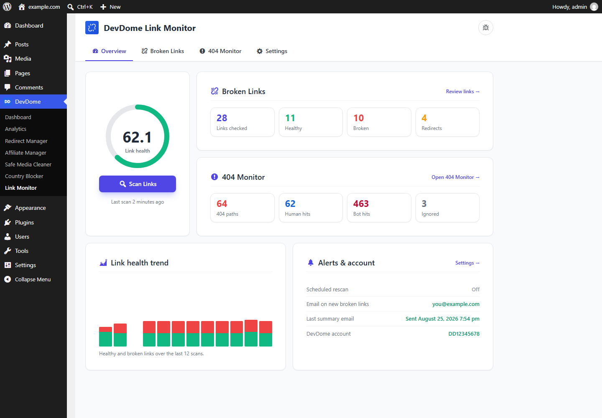
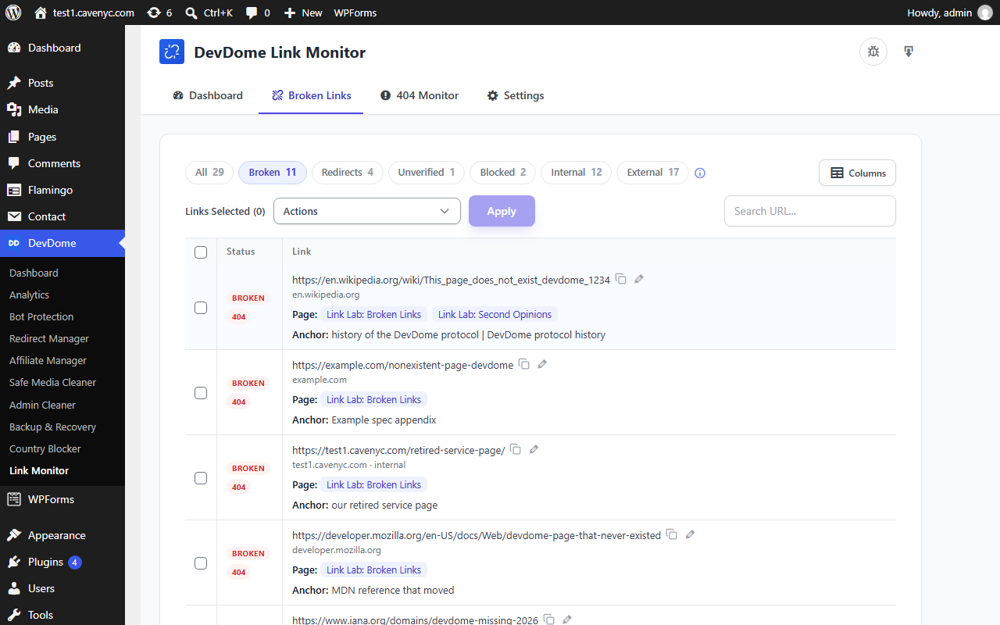
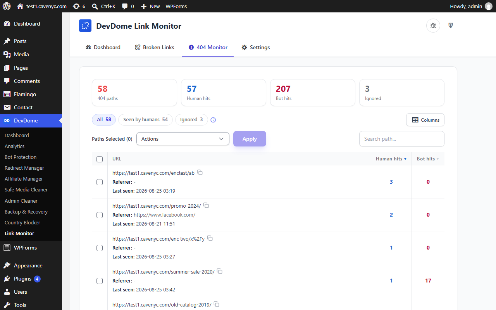
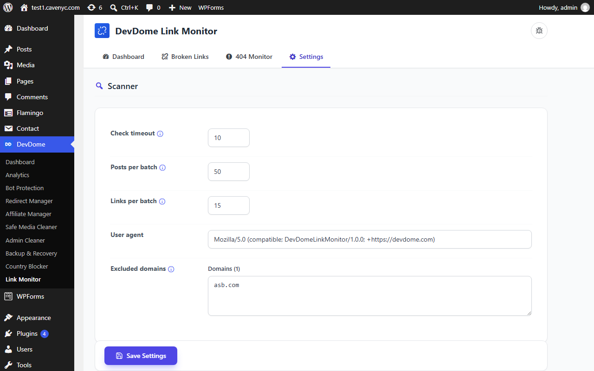

# DevDome Link Monitor: Broken Link Checker, Dead Links & 404 Monitor

[](https://wordpress.org/plugins/devdome-link-monitor/)
[](https://wordpress.org/plugins/devdome-link-monitor/)
[](https://wordpress.org/plugins/devdome-link-monitor/reviews/)
[](https://wordpress.org/plugins/devdome-link-monitor/)
[](LICENSE)

External link checker for published post content. Find broken images and URLs, edit exact links and log visitor or bot 404 errors. This free WordPress broken link checker combines on-demand scans with an always-on 404 monitor. Review dead links and uncertain results separately before making changes.

[](https://devdome.com)

- **Install from WordPress.org:** https://wordpress.org/plugins/devdome-link-monitor/
- **Website:** https://devdome.com
- **Support:** https://wordpress.org/support/plugin/devdome-link-monitor/

## Why DevDome Link Monitor instead of the alternatives

**The free alternative to Broken Link Checker (WPMU DEV) and Link Whisper for finding broken links and 404s in WordPress.**

| | DevDome Link Monitor | Broken Link Checker (WPMU DEV) | Link Whisper | Rank Math 404 Monitor | Redirection 404 log | Ahrefs / Screaming Frog |
|---|---|---|---|---|---|---|
| Price | **Free** | Free, cloud needs a WPMU DEV account | from $77 / year | Free (SEO suite) | Free | Paid tools, run by hand |
| Scans the links inside your content | Yes | Yes | Yes | No | No | Yes, externally |
| 404 monitor with human vs bot hits | **Yes** | No | No | Hits only | Hits only | No |
| Two-failure rule against false positives | **Yes** | No | No | n/a | n/a | n/a |
| Background slices to limit server load | Yes | Local mode is known for load | n/a | n/a | n/a | External crawl |
| Redirect suggestions from your real slugs | Yes | No | No | No | No | No |
| One-click redirect (with DevDome Redirect Manager) | Yes | No | No | Rank Math | Redirection | No |
| CSV export, auto purge, ignore list | Yes | Partial | No | Partial | Partial | Export |
| Page or link limits | None | None | Per licence | None | None | Per plan |

Prices reflect the vendors' published plans in September 2026. The external crawlers listed above run by hand; DevDome monitors incoming 404s continuously inside WordPress. Background scanning still uses server resources.

## Features

### Broken link finder for published content

Use the external link checker to review internal links, external links and missing images together. The scanner reads `<a href>` and `` URLs from saved content in published public post types, excluding attachments.

Menus, widgets, custom fields, theme options, `srcset`, embeds, non-inlined synced patterns and unpublished content are outside its scope. As a website checker, it covers published-content links, not a whole-site crawl.

### Dead link checker with separate verification results

The broken link scanner requires two failures separated in time before marking a URL broken. HEAD requests receive a size-capped GET fallback before a failure is recorded.

- Timeouts, DNS failures, TLS errors and refused connections remain **Unverified**.
- Authentication, blocking and rate-limit responses remain **Could not verify**.
- Redirect results include the final URL and hop count.

These checks reduce false positives without guaranteeing detection: a “page not found” response with HTTP 200 still counts as healthy.

### Fix broken links and replace links

For links not working, review the source page and anchor text, then choose:

- **Edit URL:** replace an exact link across posts containing it.
- **Unlink:** remove the link while keeping its text.
- **Re-check now** or **Dismiss:** verify again or set aside an intentional link.

The search replace scope covers exact link URLs only. Content edits require permission on every affected post, retain WordPress revisions and record an audit trail.

Filters cover broken, redirected, unverified, blocked, internal and external results. Search, bulk actions and a column picker help organize reviews.

### 404 not found monitoring and 404 redirect suggestions

The always-on log records requests reaching a 404 page:

- Normalized path, hit count, first and last seen.
- Last referrer and optional last user agent.
- Human and bot counts classified by user-agent patterns, plus a humans-only view.
- Per-path ignore, deletion, CSV export and automatic purging.

Suggestions fuzzy-match missing paths against published post and page slugs. To redirect 404 requests, use DevDome Redirect Manager's one-click action or copy the suggested `.htaccess` rule.

The scan also serves as a 404 checker for URLs in published content; incoming missing-page requests are logged separately.

### Link health for a content audit

The Overview shows link health, checked and healthy totals, broken links, redirects, human and bot 404 totals, alerts and a trend across 12 scans.

Use it alongside your seo tools for the broken-link portion of an seo audit or site audit. The score describes the scan's coverage, not overall website quality.

### Background scans and settings

Start, pause, resume or cancel resumable scans driven by your browser or WP-Cron. Small batches and per-host spacing limit load.

Configure timeout, posts and links per batch, user agent and excluded domains. Optional weekly or monthly rescans can email newly broken-link counts through DevDome when an account is connected.

## Screenshots

[](https://devdome.com)
*Dashboard: link health, broken link totals, 404 totals with human and bot hits, trend and alerts.*

[](https://wordpress.org/plugins/devdome-link-monitor/)
*Broken links: every checked link with status, page and anchor text.*

[](https://devdome.com)
*404 monitor: path, referrer, last seen, human and bot hits.*

[](https://wordpress.org/plugins/devdome-link-monitor/)
*Settings: timeout, batch sizes, user agent, excluded domains.*

## AI agents and MCP (WordPress Abilities API)

Since 1.6.0, WordPress 6.9+ supports the plugin's [WordPress Abilities](https://developer.wordpress.org/apis/abilities-api/). Connected agents and MCP clients, including Claude, ChatGPT and Cursor, can discover exposed abilities through the official [WordPress MCP Adapter](https://github.com/WordPress/mcp-adapter).

The original six read and scan abilities remain:

| Ability | What it does | Permission |
|---|---|---|
| `devdome-link-monitor/get-link-summary` | Link health score, ok / broken / redirect / timeout / blocked totals, last scan time, 404 totals | view |
| `devdome-link-monitor/get-broken-links` | Links from the last scan with status, HTTP code, error, anchor text and the pages they appear on; `filter` = broken (default), redirects, timeouts, blocked, internal, external, all; `search`, `page`, `per_page` | data |
| `devdome-link-monitor/get-404s` | The 404 log: path, human hits, bot hits, referrer, first and last seen; `humans_only`, `orderby`, `search`, paging | data |
| `devdome-link-monitor/get-scan-progress` | Whether a scan is running, phase, percent, processed / total | view |
| `devdome-link-monitor/run-link-scan` | Start a scan; `mode` = full (default) or recheck (re-verify last scan's broken, unverified and blocked links). Runs in the background | scan |
| `devdome-link-monitor/recheck-link` | Check one link again now by `link_id` and return its updated status | scan |

These six are `public` and `show_in_rest` at authenticated `GET /wp-json/wp-abilities/v1/abilities`. Reads carry `readonly`; none of these six is destructive. The default MCP server exposes direct tools such as `devdome-link-monitor-get-broken-links` alongside discover / execute meta-tools.

Current abilities also cover content edits, scan controls and history, redirect suggestions, 404 management, exports, settings and logs. All use the screens' code and capability checks; content edits retain per-post checks. Anonymous requests have no access.

Install the adapter, create an administrator application password and add the site to Claude Code:

```json
{"mcpServers":{"my-site":{"type":"http","url":"https://example.com/wp-json/mcp/mcp-adapter-default-server","headers":{"Authorization":"Basic <base64 user:application-password>"}}}}
```

Verified 2026-09-10 with Claude Code: “find the broken links on this site”, “which 404s do real people hit most” and “re-verify the broken links” selected the right abilities unaided. A subscriber account was refused.

## Requirements

WordPress 6.0+, PHP 7.4+. Link checks run from your server without an account. Verification requires PHP cURL; unavailable transport leaves URLs unverified.

## Installation

1. In wp-admin, open **Plugins > Add New**, search **DevDome Link Monitor**, install and activate.
2. Open **DevDome > Link Monitor** and press **Scan Links**. The 404 monitor is already running.

## Part of the DevDome plugin family

Free WordPress plugins by [DevDome](https://devdome.com): Analytics (cookieless, bot and AI crawler split, public API and MCP server), Redirect Manager, Media Cleaner, Link Monitor and Affiliate Manager.

Every plugin includes the DevDome Dashboard inside wp-admin, where the others install in one click.

## Development

This repository mirrors the WordPress.org release. Open an issue here for bugs or feature requests, or use the [support forum](https://wordpress.org/support/plugin/devdome-link-monitor/).

## License

GPL-2.0 or later. See [LICENSE](LICENSE).
